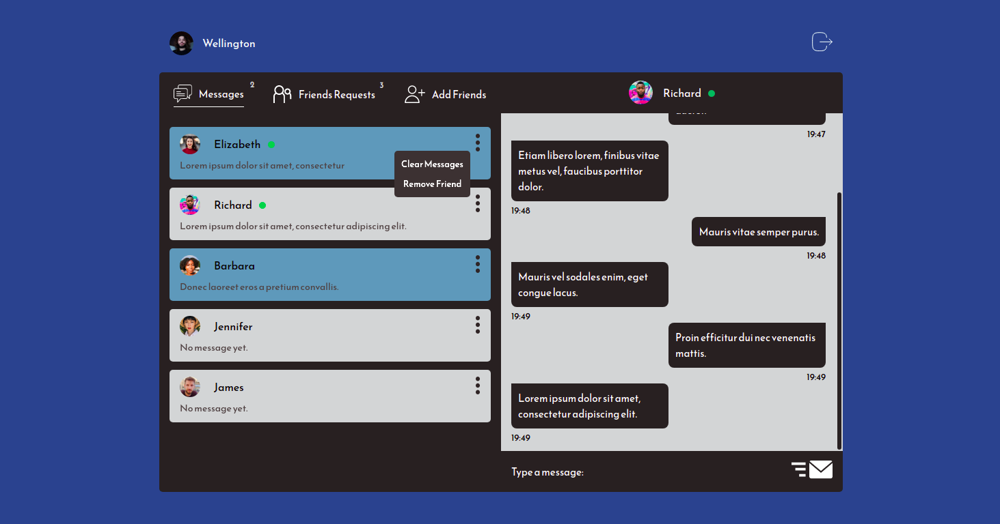

# React Chat :speech_balloon:


### Chat with your friends, add new and delete annoying ones :smiley: 
 

## Features
- [x] Chat privately 
- [x] Add new friends
- [x] Delete friends
- [x] Clear messages
- [x] Set avatar icon

## Technologies: 
- React
  - Styled Components
  - Redux (@reduxjs/toolkit)
- NodeJS
  - Express
  - SocketIO
  - Mongoose
  - Multer

## How to install
Clone this repo, install dependencies with yarn or npm.<br><br>
Set these environment variables: <br><br>
Server 
```env
MONGO_URI=YOUR_MONGO_URI
JWT_SECRET=SOME_RANDOM_VALUE
PORT=CHOSEN_NETWORK_PORT
```
Client
```env
REACT_APP_API_HOST=API_HOSTNAME
```

# 
### Created By [Wellington Pacheco](https://github.com/WellingtonBP/)
